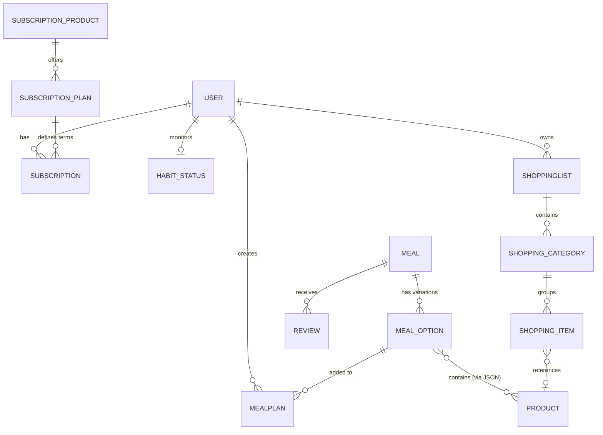

# DOMAIN_MODEL.md: Vitaflix Entity Architecture

This document defines the core entities and their relationships within the Vitaflix ecosystem, serving as a structural guide for database design and API development.

## 1. Entity-Relationship Overview

## 2. Core Entities

### User
The central actor of the system.
- **Attributes**: `Id`, `Email`, `Password`, `Genre`, `Height`, `Weight`, `Birthday`, `Objective`, `Tmb`, `RecommendedKcalIntake`, `ExtraDataComplete`.
- **Logic**: Calculates nutritional targets during onboarding.

### Product (Ingredient)
The fundamental building block for all recipes.
- **Attributes**: `Id`, `Name (JSON)`, `Kcal`, `Protein`, `Carbs`, `Fat`, `Tag`, `IsPublic`.
- **Logic**: All nutritional calculations are derived from these values per 100g/ml.

### Meal (Recipe Base)
The content entity representing a dish.
- **Attributes**: `Id`, `Name (JSON)`, `MealTypes`, `CookTime`, `PreparationMode (JSON)`, `Satiety`, `Restrictions`.
- **Note**: This is the "Netflix" content entry, independent of specific portion sizes.

### MealOption (Caloric Variation)
A specific caloric version of a `Meal`.
- **Attributes**: `Id`, `AssociatedMealId`, `Ingredients (JSON)`, `Kcal`, `IsDefault`.
- **Logic**: Stores the exact quantity of `Products` needed to reach a specific calorie target.

### MealPlan
A user's nutritional schedule.
- **Attributes**: `Id`, `UserId`, `Name`, `SelectedMeals (JSON matrix)`.
- **Logic**: Maps specific `MealOptions` to days of the week and meal slots.

### ShoppingList
A tool for resource acquisition.
- **Entities**: `ShoppingList` -> `ShoppingCategory` -> `ShoppingItem`.
- **Logic**: Items can be manually added or auto-populated from a `MealPlan`.

### Subscription & Payment
The monetization layer.
- **Entities**: `SubscriptionProduct`, `SubscriptionPlan`, `Subscription`, `Transaction`.
- **Logic**: Manages access levels and recurring billing status via Stripe/PayPal.

## 3. Data Integrity Rules
- **Multilingualism**: All user-facing strings for content (`Name`, `Description`, `PreparationSteps`) must be stored in JSON format to support PT/EN.
- **Precision**: Caloric totals in `MealOption` must be the sum of its `Ingredients` based on their respective `Product` nutritional data.
- **Ownership**: Data such as `MealPlans` and `ShoppingLists` must be strictly scoped to the `UserId`.
