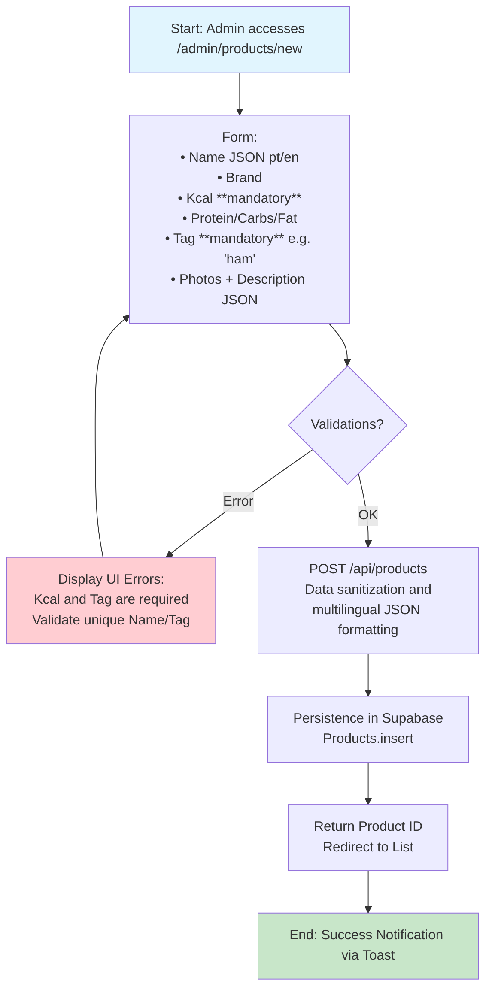

# Flow 1: Register Products (Ingredients)

## Description
Registration of individual ingredients (food products) with mandatory nutritional data. This registry serves as the fundamental building block for creating recipes and caloric variations. "Tags" function as identifiers or free categories, without the need for a separate category table.

## Tables and Relationships

```text
Main Table: Products (Id PK)
├── Picture (bigint) → Reference for product image storage
├── BrandPicture (bigint) → Reference for specific brand image
└── IsPublic (boolean) → Defines if the ingredient is available to all users

Relationships:
- No Foreign Keys (FKs) for categories (Tag is a free varchar field).
- Tag Examples: "extra-ham", "salmon", "greek-yogurt", "seasoning".
- Mandatory Data: Name (multilingual JSON), Kcal (Integer), Tag (Varchar).
```

## Mermaid Diagram (Sequential Flow)



## AI Codegen Specifications

```text
• Frontend (Web): Next.js + React Hook Form + Zod for schema validation.
• Backend (API): Next.js API Routes with direct Supabase client integration.
• Field Validations:
  - Kcal: Integer > 0 (mandatory).
  - Tag: Unique string, lowercase, slug format (no spaces or special characters).
  - Name: Mandatory JSON structure { "pt": "Nome em Português", "en": "Name in English" }.
• Interface (UI): Quick creation modal or full form page with real-time macro preview.
• Mobile (React Native): Reuse of Zod validation schema (shared logic) to ensure cross-platform consistency.
• Extra Functionality: Autocomplete on the Tag field based on existing tags in the database to avoid semantic duplication.
```