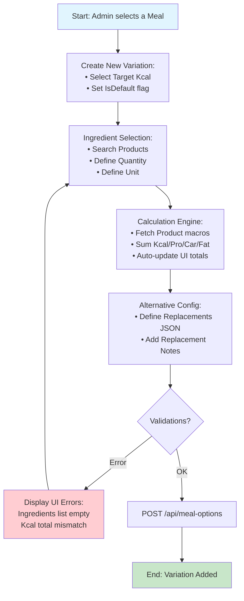

# Flow 3: Create Caloric Variations (MealOptions)

## Description
This is the core "Netflix of Recipes" logic. For each base recipe (Meal), the admin creates multiple versions with different calorie targets (e.g., 200kcal, 300kcal, 400kcal). This flow links specific **Products** to a **Meal**, defining exact quantities and calculating the final nutritional macros.

## Tables and Relationships

```text
Main Table: MealOptions (Id PK)
├── FK.AssociatedMeal (bigint) → Link to the parent Meal
├── Ingredients (json) → List of Product IDs + Quantities + Units
├── Replacements (json) → Alternative ingredients for the user
├── Kcal/Protein/Carbs/Fat (double precision) → Calculated totals for this variation
├── IsDefault (boolean) → Primary version shown in the app
└── Photo (bigint) → Specific photo for this caloric version
```

**Relationships:**
- **FK.AssociatedMeal (Many-to-One)**: Links back to `public.Meals(Id)`.
- **Ingredients JSON**: Contains an array of objects referencing `public.Products(Id)`.
- **Replacements JSON**: Contains alternative product options to maintain the same calorie profile.

## Mermaid Diagram (Sequential Flow)



## AI Codegen Specifications

```text
• Frontend (Web): Next.js + Dynamic Ingredient List (Add/Remove rows).
• Macro Calculation (Real-time):
  - Formula: (Product_Kcal / 100) * Quantity.
  - State management to update "Total Kcal/Protein/Carbs/Fat" as quantities change.
• Ingredient JSON Structure:
  { "Object": [ { "Product": 209024..., "Quantity": 120, "Unit": "g" } ], "Locale": "pt-PT" }
• Replacements JSON Structure:
  { "Object": [ { "Name": "Rice", "Ingredients": [...] } ], "Locale": "pt-PT" }
• Field Validations:
  - FK.AssociatedMeal: Must be a valid existing Meal ID.
  - Kcal: Total must be non-zero.
  - IsDefault: Only one "true" allowed per Meal ID (logic to reset others if true).
• UI Components:
  - Product Search/Autocomplete within the ingredients row.
  - "Clone Variation" feature to quickly create 300kcal from a 200kcal version.
```