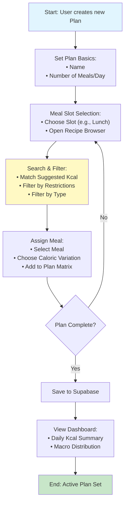

# Flow 5: Meal Plan Creation (Criação de Plano Alimentar)

## Description
This flow allows users to organize their weekly or daily nutrition by selecting specific recipes for defined meal slots (e.g., Breakfast, Lunch, Dinner). The system provides recommendations based on caloric targets and allows for automatic resets or manual adjustments.

## Tables and Relationships

```text
Main Table: MealPlans (Id PK)
├── UserId (bigint) → Owner of the plan
├── Name (varchar) → Plan title (e.g., "Weight Loss Week 1")
├── SelectedMeals (json) → Matrix of days/slots and selected IDs
└── AutomaticMealReset (boolean) → Reset plan weekly toggle

Relationships:
- MealPlans (N:1) → Users (UserId)
- SelectedMeals (JSON) → References Meal(Id) and MealOption(Id)
- Mapping Logic → Links to SuggestionMappings for kcal recommendations
```

## Mermaid Diagram (Sequential Flow)



## AI Codegen Specifications

```text
• Frontend (Mobile/Web): Calendar-style grid or daily vertical list.
• JSON Data Structure (SelectedMeals):
  {
    "Monday": {
      "breakfast": { "MealId": 123, "OptionId": 456 },
      "lunch": { "MealId": 789, "OptionId": 012 }
    }
  }
• Recommendation Logic:
  - Integration with SuggestionMappings table to suggest specific kcal versions per slot based on the user's total daily target.
• Field Validations:
  - Ensure selected MealOptionId belongs to the selected MealId.
  - AutomaticMealReset: If true, backend cron job or trigger clears/clones plan on Sunday night.
• UI Components:
  - "Quick Add" based on favorites.
  - Daily progress bar showing (Planned Kcal vs. Target Kcal).
  - Multi-select recipe browser with caloric filters.
• Mobile (React Native): Home screen integration to show "Next Meal" from the active plan.
```