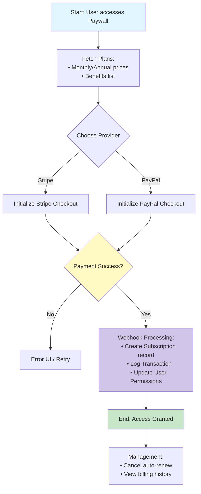

# Flow 6: Subscriptions & Payments System

## Description
This flow handles the monetization of the application. It manages the availability of subscription plans, the checkout process via external providers (Stripe/PayPal), and the management of active subscription statuses. Access to premium content is gated based on the verification of these records.

## Tables and Relationships

```text
Tables: 
1. SubscriptionProducts (Id PK) -> The offer (e.g., "Vitaflix Premium")
2. SubscriptionPlans (Id PK) -> The terms (e.g., "Monthly", "Annual")
3. Subscriptions (Id PK) -> The user's active contract
4. Transactions (Id PK) -> Ledger of individual payments

Relationships:
- SubscriptionProducts (1:N) → SubscriptionPlans
- SubscriptionPlans (1:N) → Subscriptions
- Users (1:N) → Subscriptions
- Subscriptions (1:N) → Transactions
```

## Mermaid Diagram (Sequential Flow)



## AI Codegen Specifications

```text
• Backend (Next.js):
  - Webhook Handlers: Secure endpoints to receive Stripe/PayPal events (payment_intent.succeeded, customer.subscription.deleted).
  - Middleware: Access control to gate /api/meals and /api/plans based on active subscription status.
• External IDs:
  - Tables must store `StripePlanId`, `StripeProductId`, and `PayPalPlanId` to sync with provider catalogs.
• Subscription Statuses:
  - Enum: 'active', 'canceled', 'incomplete', 'past_due', 'trialing'.
• UI Components:
  - Pricing toggle (Monthly/Yearly).
  - "Manage Subscription" portal link (Stripe Customer Portal).
  - Locked content placeholders (Blur/Overlay) for non-subscribers.
• Mobile (React Native):
  - Integration with Stripe SDK or WebView for secure checkout.
  - Verification of "ActionTaken" flag to ensure UI reflects payment immediately after webhook.
```