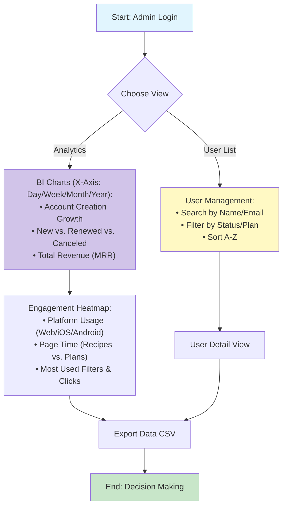

# Flow 8: Admin Dashboard (Business Intelligence & Management)

## Description
The central management hub for Bruno (Admin) to monitor business health, user engagement, and financial performance. It combines a detailed User Management table with a series of analytical charts (Bar/Line) to track growth, revenue, and feature usage across Web, iOS, and Android platforms.

## Tables and Relationships

```text
Tables: 
1. Users (Main source for profile and registration data)
2. Subscriptions (Linked via UserId for status and billing cycles)
3. Transactions (Linked via SubscriptionId for revenue calculation)
4. SessionTokens (Linked via UserId for "Last Login" and "App Platform" tracking)
5. Reviews (User feedback management)

Relationships:
- Users (1:N) → Subscriptions → Transactions (Historical Revenue)
- Users (1:N) → SessionTokens (Real-time activity tracking)
- Metrics Engine: Queries logs to count clicks on Recipes and Filter usage.
```

## Mermaid Diagram (Sequential Flow)



## AI Codegen Specifications

```text
• Frontend (Web): Next.js + TanStack Table (for sorting/filtering) + Recharts/Chart.js (for bars).
• Backend (API): Complex Aggregation Queries.
  - Revenue Calculation: SUM(Transactions.Amount) grouped by 'New' vs 'Renewal'.
  - Retention Logic: Calculate "Churn Rate" by comparing Canceled vs Active in the period.
• User Table Fields:
  - Status: Active, Past Due, Canceled.
  - Plan Type: Monthly, Quarterly, Annual, Admin.
  - Billing: Next Payment Date, Number of Renewals.
• Tracking Strategy:
  - Middleware/Analytics: Log clicks on Recipes and Filter events to a 'UserActivity' table.
  - Platform detection: Store 'App' type (iOS/Android/Web) in the SessionTokens during login.
• UI Components:
  - Date Range Picker (Daily, Weekly, Monthly, Yearly).
  - Dashboard Cards: "Big Numbers" for MRR and Active Users.
  - Bar Charts: Stacked bars for New vs. Renewed subscriptions.
• Security: Strict RBAC (Role-Based Access Control). Only Users with 'Permissions' = 'admin' can access /api/admin/*.
```