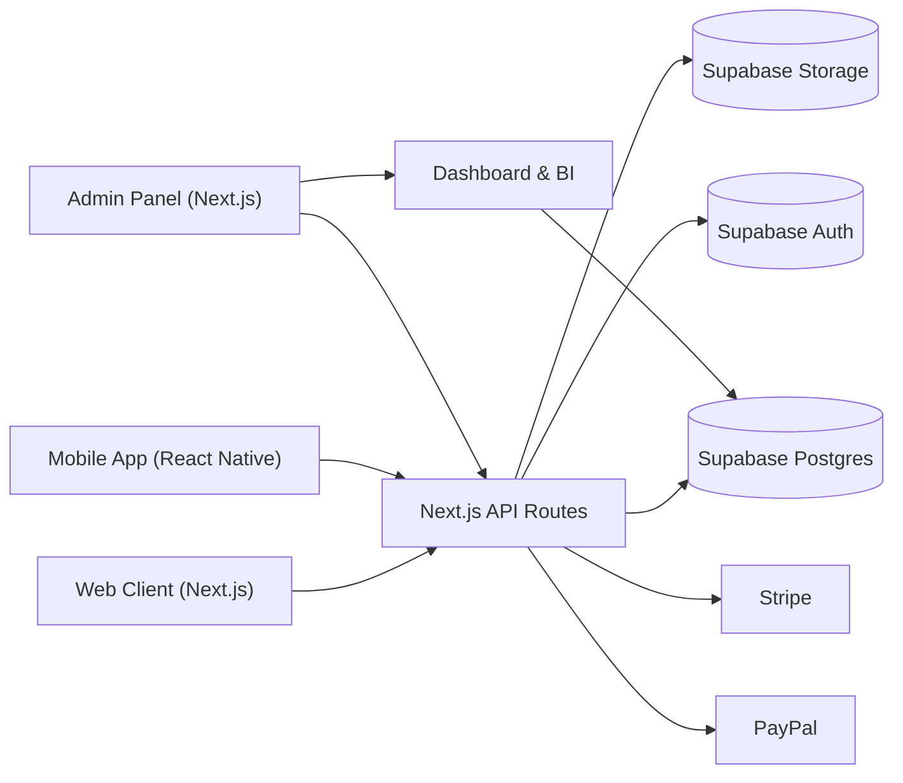

# ARCHITECTURE.md: Vitaflix Platform Architecture

This document describes the planned technical architecture for Vitaflix, aligned with the project goals: multi-platform support (Web + Mobile), AI-assisted development, and a strong separation of concerns between frontend, backend, and data.

---

## 1. High-Level Overview

Vitaflix is built as a **modern TypeScript-first stack** with:

- **Web App & Admin Panel**: Next.js
- **Mobile Apps**: React Native (Android + iOS)
- **Backend & Data Layer**: Supabase (Postgres + Auth + Storage + Edge Functions)
- **Payments**: Stripe (primary) + PayPal (optional)
- **AI & Automation**: Shared schemas and Markdown specs to drive AI code generation (e.g., Antigravity).

### System Diagram (Conceptual)

---

## 2. Frontend Architecture

### 2.1 Web App (Next.js)

**Responsibilities:**
- Public marketing/landing page.
- Recipe catalog browsing ("Netflix experience").
- Web client for meal plans, shopping lists, and account management.
- Admin area (Bruno) for managing Products, Meals, MealOptions, and Dashboards.

**Key Choices:**
- **Framework**: Next.js (App Router).
- **Language**: TypeScript.
- **Forms & Validation**: React Hook Form + Zod (shared schemas).
- **State Management**: Lightweight (React Query / TanStack Query for server state).
- **Styling**: Tailwind CSS or similar utility-first framework.

### 2.2 Mobile Apps (React Native)

**Responsibilities:**
- Main user experience for end-users (Android + iOS).
- Onboarding (gender, height, weight, goals).
- Daily/weekly plan consumption.
- Shopping list usage in-store.

**Key Choices:**
- **Framework**: React Native.
- **Navigation**: React Navigation.
- **Validation**: Zod schemas imported from shared libraries.
- **Auth**: Supabase Auth (JWT/session) shared with Web.

---

## 3. Backend & Data Architecture

### 3.1 Supabase (PostgreSQL + Auth + Storage)

Supabase is used as the **primary backend**:

- **Database**: PostgreSQL with the existing schema (`vitaflix.sql`).
- **Auth**: Email + password and token-based sessions.
- **Storage**: Recipe photos, product images, and user avatars.

### 3.2 API Layer (Next.js API Routes)

Even when using Supabase directly on the client, the architecture provides a **dedicated API layer** to:

- Apply sensitive business rules (e.g., only 1 `IsDefault` per `Meal`).
- Encapsulate complex logic (e.g., macro calculations, variant generation).
- Standardize usage across Web and Mobile.
- **Payment Pattern**: Mandatory use of a **Factory/Provider pattern** for payment integrations. We will use **Stripe** as the primary provider now, with **PayPal** planned for the future.

---

## 4. Shared Libraries & Codegen Support

### 4.1 Shared Schemas (Domain-Driven)

The `libs/` folder (or `packages/` in a monorepo) will contain shared Zod schemas:
- `product.schema.ts`, `meal.schema.ts`, `mealOption.schema.ts`, `mealPlan.schema.ts`.

**Benefits:**
- Web and Mobile share the same contract.
- APIs validate the same structure.
- Ideal for AI: a single source of truth defining models.

---

## 5. Payments & Subscription Architecture

### 5.1 Stripe & PayPal

**Workflow:**
- Frontend calls `/api/subscriptions/checkout`.
- API creates a checkout session in Stripe/PayPal.
- After payment, the provider calls a webhook (`/api/webhooks/stripe`).
- Webhook updates:
  - `Subscriptions` (status, next billing).
  - `Transactions` (amount, type: new/renewal).

---

## 6. Analytics & Dashboard

### 6.1 Admin Dashboard

Visualization layer built in the Next.js Admin using:
- **Data Sources**: Aggregated Postgres queries (via Supabase).
- **Visualization**: Bar/line charts and filterable tables.

**Key Metrics:**
- MRR (Monthly Recurring Revenue), new registrations, and churn.
- Total revenue by plan and platform.
- Engagement logs (most clicked recipes, popular search tags).

---

## 7. Deployment & Environments

- **Development**: Local dev server + Dev Supabase project.
- **Staging**: Automatic CI/CD deployment for testing.
- **Production**: Vercel (Next.js) + Production Supabase + Live Payments.

---

## 8. Security & Guardrails

- **Supabase RLS (Row-Level Security)**: Ensures users can only access/edit their own data.
- **RBAC (Role-Based Access Control)**: Restricts Admin area to authorized users only.
- **Secure Key Management**: Environment variables for Stripe/PayPal and webhook secrets.
