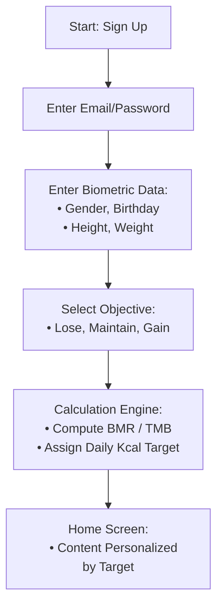
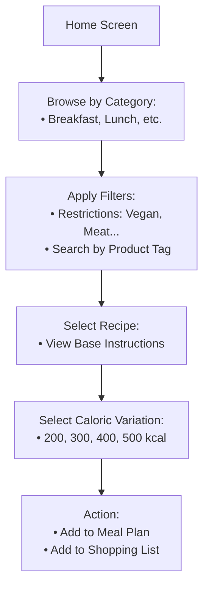
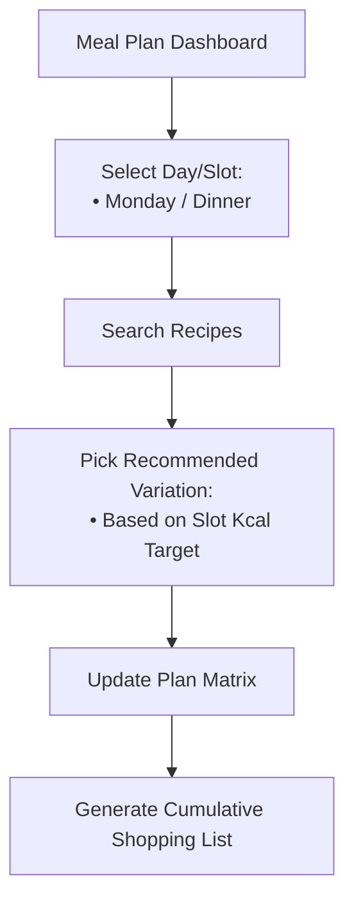
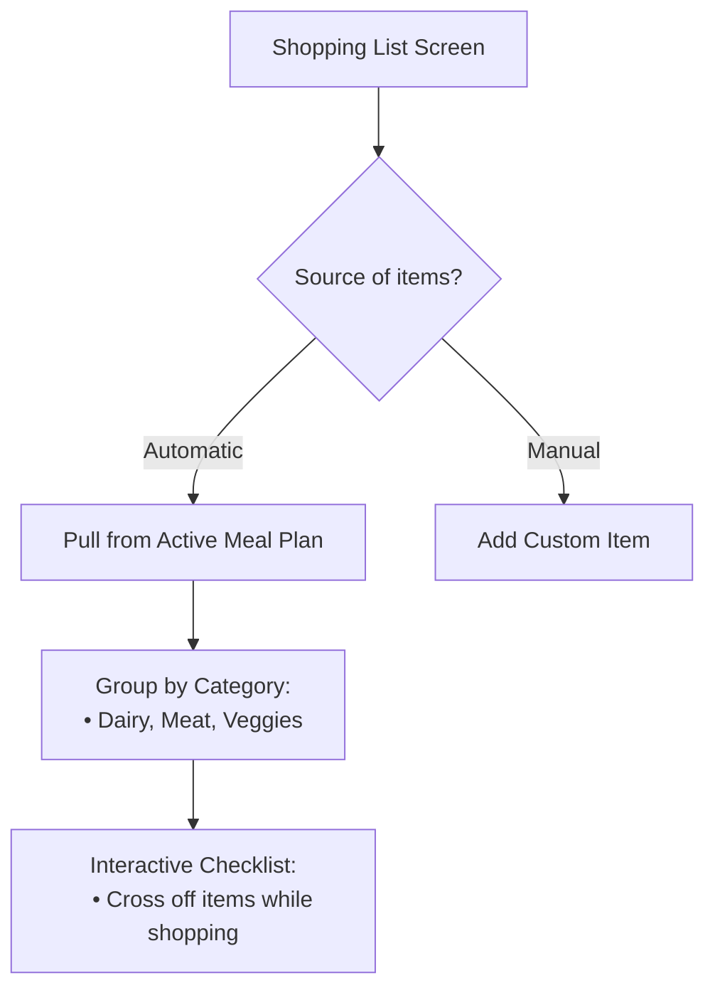
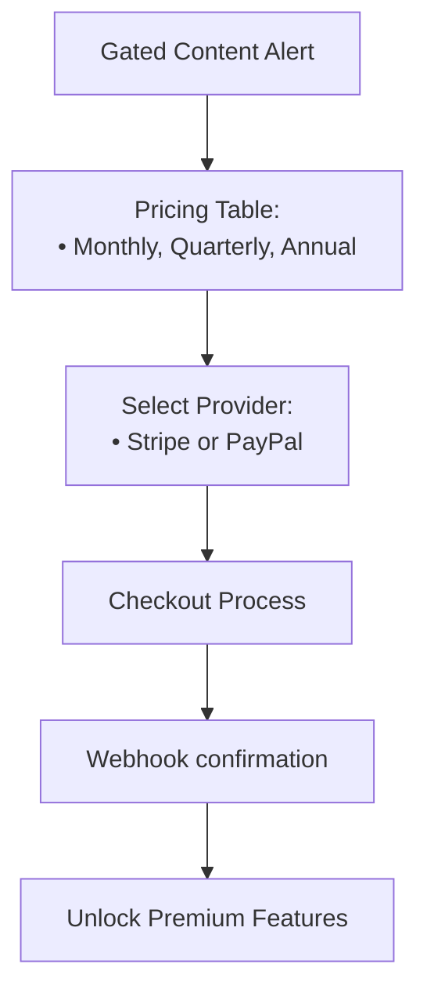
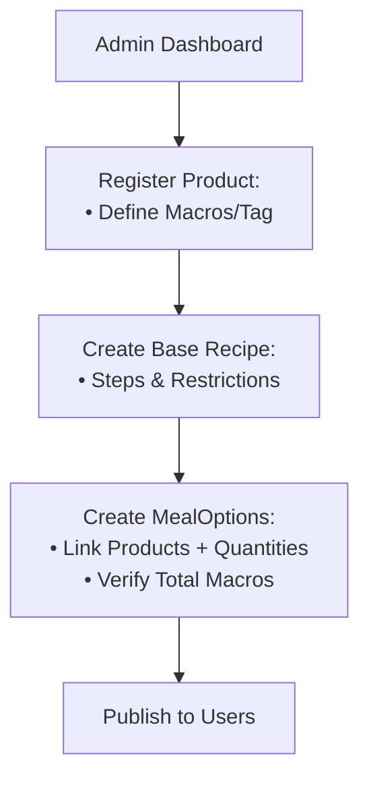
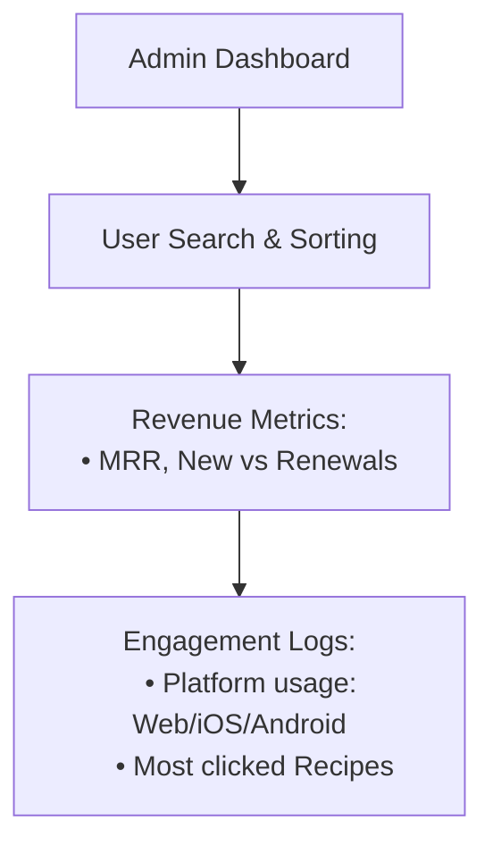

# USER_FLOWS.md: Vitaflix Core Journey

This document maps the primary user journeys within Vitaflix, from initial registration to recurring meal planning and administrative management.

**IMPORTANT**: For each flow there is detailed information in the folder `./vitaflix-flows/`

## 1. Onboarding & Personalization Flow
Goal: Create an account and establish a personalized nutritional baseline.

## 2. Recipe Discovery & Selection (The "Netflix" Wedge)
Goal: Browse and select recipes that fit the user's specific caloric needs.

## 3. Weekly Meal Planning Flow
Goal: Organize nutrition for the week using the plan matrix.

## 4. Shopping List Flow
Goal: Aggregate all ingredients needed for the selected meals.

## 5. Subscription & Paywall Flow
Goal: Convert free/onboarded users into paying subscribers.

## 6. Admin Content Management Flow (Bruno)
Goal: Maintain the product and recipe database.

## 7. Business Performance Monitoring (BI)
Goal: Track financial and engagement health.

