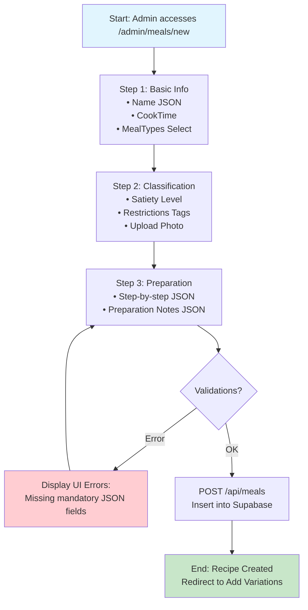

# Flow 2: Register Recipes (Meals)

## Description
Registration of the base recipe structure. This step defines the identity of the meal, including its preparation steps, cooking time, and dietary classifications. It does **not** define quantities or calories yet (this is handled in the next step, MealOptions).

## Tables and Relationships

```text
Main Table: Meals (Id PK)
├── Name (json) → Multilingual title (e.g., { "pt": "Wrap Misto", "en": "Mixed Wrap" })
├── MealTypes (text) → Category (breakfast, midmorning, lunch, midafternoon, dinner)
├── CookTime (integer) → Time in minutes
├── PreparationMode (json) → Step-by-step instructions
├── Satiety (integer) → Satiety level (0-5)
├── Restrictions (text) → Array of tags (meat, fish, seafood, vegan, lactose)
└── IsDraft (boolean) → Status control for publishing
```

**Relationships:**
- **Parent to MealOptions**: One `Meal` can have multiple `MealOptions` (caloric variations).
- **Reviews**: One `Meal` can have multiple `Reviews` (linked via `MealId`).

## Mermaid Diagram (Sequential Flow)



## AI Codegen Specifications

```text
• Frontend (Web): Next.js + Multi-step form approach (Steppers).
• Multi-language Handling: Input fields for both "pt" and "en" stored as JSON.
• Field Validations:
  - Name: Mandatory JSON structure.
  - MealTypes: Must match allowed strings (breakfast, lunch, etc.).
  - CookTime: Integer > 0.
  - Restrictions: Stored as a string representation of an array (e.g., 'meat,lactose').
• UI Components:
  - Dynamic list for "PreparationMode" steps.
  - Satiety rating component (Stars or Numeric).
  - Multi-select for "Restrictions".
• Mobile (React Native): Detailed view of the recipe using the "PreparationMode" steps list.
```