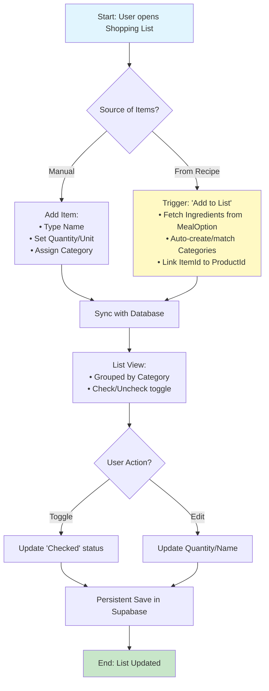

# Flow 4: Shopping List

## Description
This flow manages the user's grocery lists. It allows for manual item entry or automatic population based on selected recipes. Items are organized by categories to facilitate the in-store experience. The system synchronizes quantities and units from the product database.

## Tables and Relationships

```text
Tables: 
1. ShoppingLists (Id PK) -> The container (e.g., "Weekly Groceries")
2. ShoppingCategories (Id PK) -> Groups (e.g., "Dairy", "Vegetables")
3. ShoppingItems (Id PK) -> The actual products/entries

Relationships:
- ShoppingLists (1:N) → ShoppingCategories
- ShoppingCategories (1:N) → ShoppingItems
- ShoppingItems (N:1) → Products (Optional ItemId link)
- ShoppingLists (N:1) → Users (UserId owner)
```

## Mermaid Diagram (Sequential Flow)



## AI Codegen Specifications

```text
• Frontend (Web & Mobile): React Native / Next.js with optimistic UI updates for checking items.
• Integration Logic:
  - When adding from a recipe, the system must iterate through the `MealOptions.Ingredients` JSON.
  - It should check if a `ShoppingCategory` with the same name exists in that list; if not, create it.
• Data Structure - ShoppingItems:
  - ItemType: string (e.g., 'Product' or 'Custom').
  - Checked: boolean (default false).
  - ItemId: bigint (reference to Products.Id if applicable).
• UI Components:
  - Swipe-to-delete (Mobile).
  - Accordion/Collapsible headers for Categories.
  - "Clear Checked Items" bulk action.
• Edge Case Handling:
  - If a user adds the same product twice, offer to "Merge Quantities" or "Add as separate entry".
```