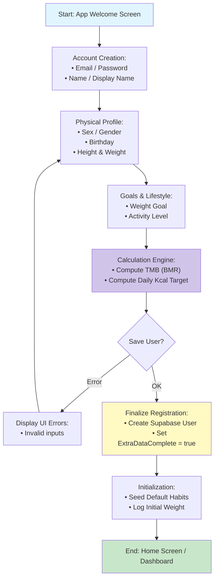

# Flow 7: User Onboarding & Registration

## Description
In the new React Native version, the onboarding process is integrated directly into the registration flow. Users provide personal physical data (sex, height, weight, objective) **during** the account creation. This data is used to calculate their Basal Metabolic Rate (BMR/TMB) and recommended daily calorie intake immediately upon first login.

## Tables and Relationships

```text
Main Table: Users (Id PK)
├── Gender/Genre (text) -> 'male', 'female'
├── Height (integer) -> In cm
├── Weight (double precision) -> In kg
├── Birthday (timestamp) -> To calculate age
├── Objective (text) -> 'lose_weight', 'gain_muscle', 'maintain'
├── Tmb (double precision) -> Calculated Basal Metabolic Rate
├── RecommendedKcalIntake (integer) -> Daily target
└── ExtraDataComplete (boolean) -> Flag to gate access to the main app

Relationships:
- Users (1:N) → HabitRegistries (Logs initial weight as the first entry)
- Users (1:N) → Habits (Initializes default tracking habits: water, steps, etc.)
```

## Mermaid Diagram (Sequential Flow)



## AI Codegen Specifications

```text
• Frontend (React Native):
  - Multi-step Funnel: Smooth transitions between data entry screens.
  - Interactive Pickers: For Height (cm/ft), Weight (kg/lbs), and Birthday.
• Business Logic (Calculations):
  - BMR (Harris-Benedict or Mifflin-St Jeor formula):
    Women: BMR = 10 * weight + 6.25 * height - 5 * age - 161
    Men: BMR = 10 * weight + 6.25 * height - 5 * age + 5
  - Target Kcal: BMR * Activity Factor (+/- Goal Offset).
• Field Validations:
  - Height: 50cm to 250cm.
  - Weight: 20kg to 300kg.
  - Age: Must be > 13 years (GDPR/COPPA compliance).
• UI Components:
  - Animated Progress Bar (Step 1 of 5).
  - Selection Cards for 'Objective' (Visual icons for Lose/Gain/Maintain).
  - Summary Screen: "Your daily target is X kcal" before entering the app.
• State Management:
  - Temporary local state (Zustand/Redux) to hold onboarding data before the final API call to `public.Users`.
```